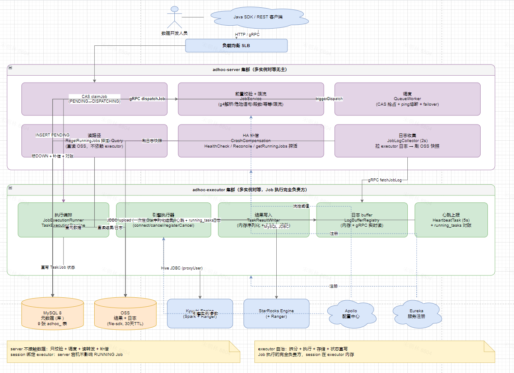
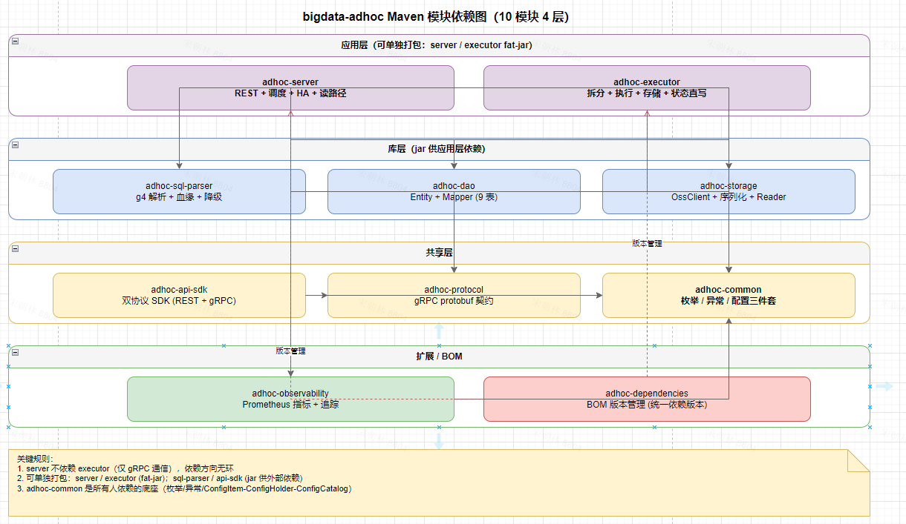
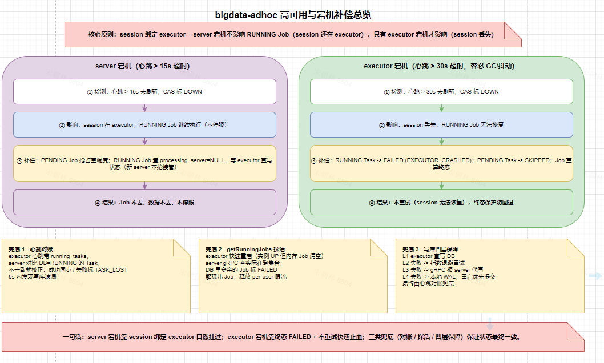
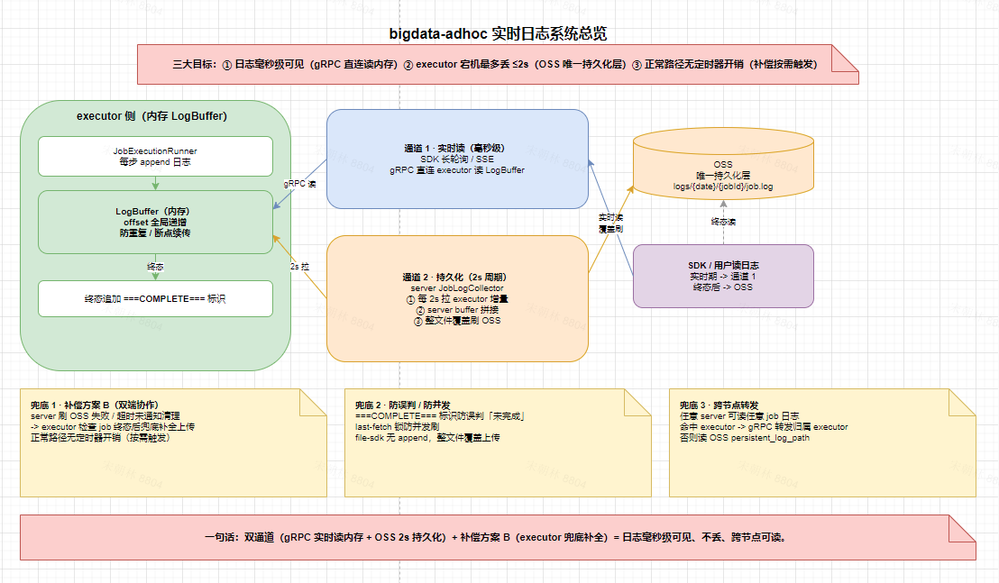
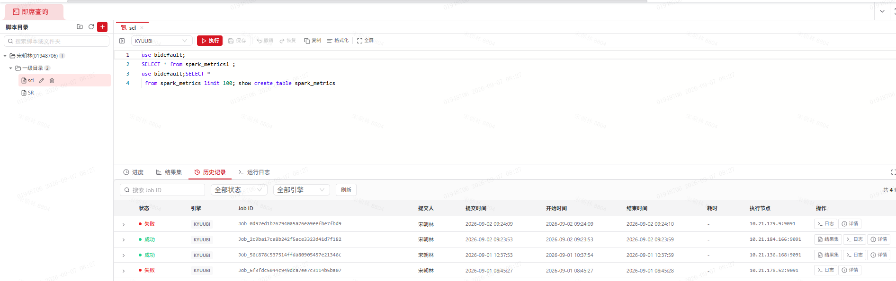
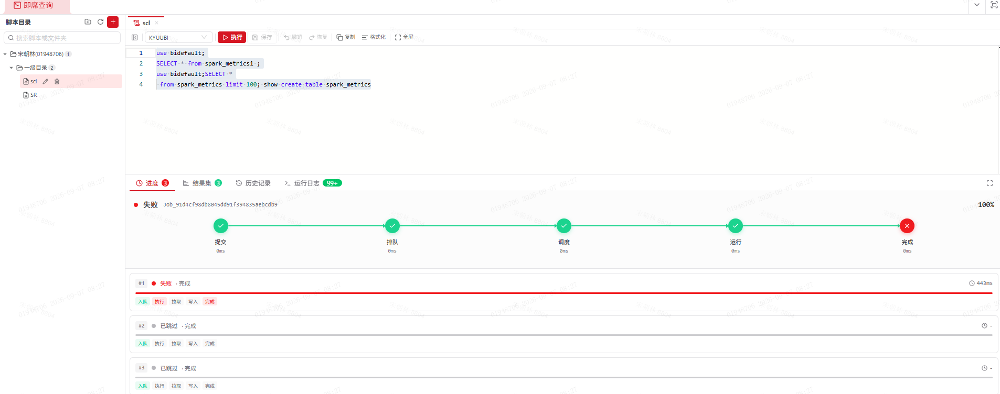
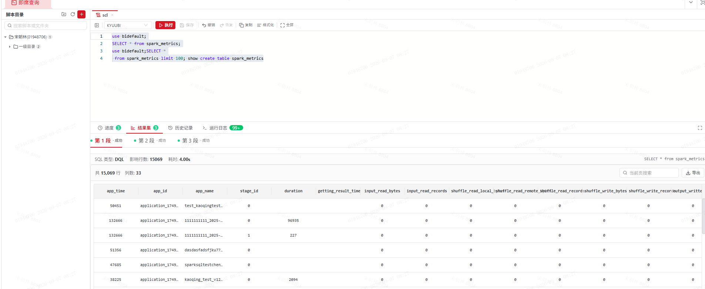
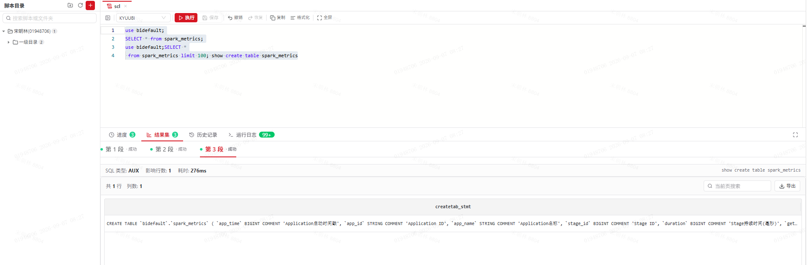
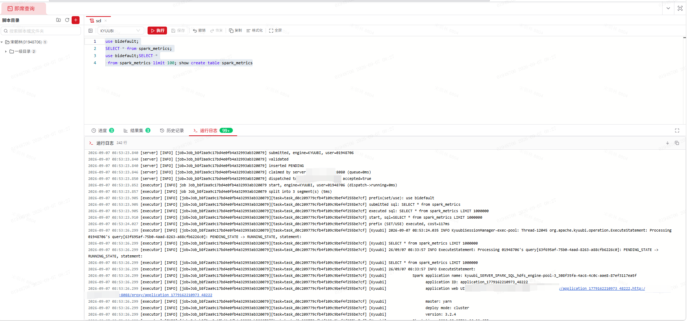

# 即席查询项目架构介绍

# 01 项目概述与架构

## 1\. 项目定位 

`bigdata-adhoc` 是面向数据开发人员的**即席查询（Ad\-hoc Query）平台**。数据开发同学通过 Java SDK 或 REST API 提交 SQL，平台自动完成 SQL 解析、前置校验、调度派发、引擎执行、结果持久化、日志收集，并提供取消、进度查询、结果分页、SQL 文件管理等配套能力。

- **双引擎**：KYUUBI（连接 Spark，Hive JDBC 协议，覆盖大规模离线计算）\+ STARROCKS（MySQL JDBC 协议，覆盖 OLAP 即席分析）

- **对等集群无主**：多 server、多 executor 对等部署，无 leader 选举、无分布式锁

- **server 宕机不影响在跑作业**：作业执行上下文（session）绑定在 executor，是平台健壮性的核心保证

## 2\. 建设背景

自建平台的核心目标：**低延迟、高并发、节点可控、状态可观测**。为此采用「长驻连接池 \+ 对等调度 \+ 显式限流 \+ session 绑定 executor」的架构，引擎连接复用、调度可控、故障域清晰。

## 3\. 技术栈

**建设环境**：HDP 3\.1\.4 / Hive 3\.1\.0 / Kyuubi 1\.9\.2 / StarRocks 3\.5\.8；HiveServer2 / Kyuubi JDBC 通过 ZooKeeper 服务发现。

## 4\. **整体架构**

### 4\.1 部署拓扑



```Plain Text
SDK / REST 客户端（请求头带 X-Adhoc-User-Id）
        │  HTTP / gRPC
        ▼
   负载均衡 (SLB)
        │
   ┌────┴────┐
   ▼         ▼
adhoc-server (多实例对等)        ── 前置校验 + CAS 调度 + 读路径 + HA 补偿
   │  gRPC: dispatchJob / fetchLog / cancelJob / getRunningJobs
   ▼
adhoc-executor (多实例对等)      ── Job 拆分 + Task 执行 + 结果/日志 upload OSS + 直写 DB + 心跳
   │
   ├──> MySQL（元数据）
   ├──> OSS（结果 + 日志）
   └──> KYUUBI / STARROCKS 引擎（JDBC，引擎侧部署 Ranger 做鉴权）

配置中心：Apollo   服务注册：Eureka
```

### 4\.2 组件职责

### 4\.3 **server / executor 职责划分**

这是整个架构最关键的切分。修订前 Job 执行的状态 / 数据在 server 和 executor 之间频繁交互，复杂且脆弱；修订后将 **Job 执行的完全责任交给 executor**：

切分的结果：**server 极轻量**（只做校验、调度、读转发、补偿），可水平扩展；**executor 自治**，server 宕机不影响在跑作业。

## 5 Maven模块划分

10 个 Maven 模块，分 4 层。详见 模块依赖图。

**依赖方向规则**：adhoc\-server 不依赖 adhoc\-executor（仅通过 gRPC 通信）；依赖无环。**可单独打包**：adhoc\-server / adhoc\-executor（fat\-jar 独立进程）、adhoc\-sql\-parser / adhoc\-api\-sdk（jar 发布到 Maven 仓库供外部依赖）。


## 6 核心设计原则

1. **session 绑定 executor**：session（JDBC connection）存在 executor 内存，server 宕机不影响 RUNNING Job，只有 executor 宕机才丢失 session。这是健壮性的核心。

2. **server 不接触数据**：executor 完全负责 Job 执行（拆分 \+ 调度 \+ 存储 \+ 状态）。server 轻量可水平扩展。

3. **CAS 抢占无锁**：多 server / 多 executor 对等，所有状态迁移用 `WHERE status=?` CAS 实现，不引入分布式锁、不引入 leader 选举。

4. **user\_id 隔离**：所有限制按 user 维度（PENDING / RUNNING 限流），含 user\_id 的表冗余 user\_name（中文名）。

5. **配置动态化**：流控阈值、引擎参数、超时等通过 Apollo 推送，运行时实时生效（ConfigHolder 每次 `env.getProperty` 读活值）。

6. **不做过度设计**：即席场景，不引入复杂共识算法、不建事件流水表、不做租户隔离、不做 AUTO 引擎推算。


## 7\. 核心数据流

SDK 提交 SQL \-\> server 前置校验 \+ 入库 PENDING \-\> QueueWorker CAS 抢占 \+ 选 executor \+ gRPC dispatchJob \-\> executor 拆分 SQL \+ 顺序执行 Task \+ 结果 upload OSS \+ 直写 DB \-\> server 直读 OSS 返回结果；日志运行中 gRPC 读 executor 内存、终态读 OSS 快照。



# 02 核心方案设计

## 1 任务调度与执行 

### 1\.1 核心机制

采用 **Job \+ Task 两层模型**：Job 是用户一次提交（可能含多段 SQL），Task 是 executor 拆分后的单段可执行 SQL。

- **server 侧**：`QueueWorker` 扫描 PENDING Job → `claimJob` CAS 抢占（`PENDING -> DISPATCHING`）→ 选 executor → gRPC `dispatchJob` 下发整个 Job。

- **executor 侧**：`JobExecutionRunner` 接收 Job → 创建 session（JDBC connection）→ 拆分 SQL 创建 Task → 按 `segment_index` 顺序执行 → 结果 upload OSS → 直写 DB 状态 → 聚合 Job 终态。

所有状态迁移通过 CAS（`WHERE status=?`）实现终态保护，executor 直写与 server HA 补偿可安全并发。

### 1\.2 关键设计决策

### 1\.3 核心类

`QueueWorker`（调度抢占）、`JobExecutionRunner`（执行编排）、`TaskExecutionPipeline`（单 Task 管道）、`TaskCreator`、`JobStateWriter` / `TaskStateWriter`（集中 DB 状态写）、`JobAggregator`、`CancelChecker`、`FailureContext`。

## 2 SQL解析与治理

### **2\.1 核心机制**

按用户显式指定的 `engineType` 选用对应 g4 解析器（KYUUBI=Spark SQL g4，STARROCKS=StarRocks g4），通过 ANTLR4 产出 AST，提取 SqlType（11 类）、表级血缘、风险项。`SqlScriptProcessor` 完成预处理管线：**去注释 → 字符串感知分段 → 逐段 g4 解析 → SET/USE 累积为 prefixSql 合并到下一真实语句**。

server 端在创建 Job 前执行 6 项前置校验，任一失败直接拒绝（不创建 Job 记录）；executor 拆分后做 Task 级兜底校验。

### 2\.2 关键设计决策

## 3 引擎路由

### 3\.1 核心机制

`EngineSelector.select(engineType, engineInstance, userId)` 返回 `EngineContext`（含 SqlScriptProcessor \+ EngineExecutor \+ url \+ user/password \+ proxyUser）。server 侧按 `engineType` 选支持该引擎的 executor（`FIND_IN_SET(engine_types)`），按 `load_score` ASC 排序逐个尝试。executor 侧 Kyuubi 多 endpoint 由 `EndpointManager` 负载选择。

3\.2 关键设计决策

## 4 结果存储

4\.1 核心机制 

OSS（file\-sdk `FileUtil`）为**持久化后端**。executor 在 WRITING 阶段将结果全量内存序列化（`MAGIC + schema JSON + 数据行`长度前缀格式）后一次性 `upload` OSS（file\-sdk 无 append API）。server 读路径只查 DB `result_summary` \+ `OssClient.downloadFile` 直读 OSS 分页，不转发 executor、不依赖 executor 存活

### **4\.2 关键设计决策**

## 5 高可用

高可用是平台三大特性之一——目标是在 server / executor 任意节点宕机下，作业不丢、数据不丢、日志不丢、不停服。

### 5\.1 核心机制



server / executor 多实例对等无主从，**CAS 抢占**解决「不重复处理」，**心跳超时**解决「故障发现」。executor 5s 心跳 \+ 30s 超时（容忍长 GC 和网络抖动），server 5s 心跳 \+ 15s 超时。健康检查全量扫描（10s 间隔）

- **executor 宕机**：RUNNING Task 标 `EXECUTOR_CRASHED`、PENDING Task 标 `SKIPPED_DUE_TO_SESSION_LOSS`、Job 重算终态。不自动重试。

- **server 宕机**：PENDING Job 由其他 server 接管重调度；RUNNING Job 不受影响（session 在 executor），`processing_server_instance` 置 NULL。

- **executor 写库失败**：四层保障（L1 直写 → L2 重试 → L3 gRPC 转发 → L4 本地 WAL）\+ 心跳对账兜底。

### 5\.2 **关键设计决策**

## 6 执行日志 

平台内置**实时日志系统**作为独立子系统（三大特性之一）——目标是日志毫秒级可见、executor 宕机不丢（最多丢 ≤2s）、正常路径无定时器开销、跨节点可读。它是 executor（生产方）\+ server（收集方）双端协作的子系统


### 6\.1 核心机制



日志全在 executor 内存 buffer（`LogBuffer` per jobId/taskId，`ReentrantLock` 保护），实时读走 gRPC `fetchLog` / `fetchJobLog` 读内存（\~100ms）。server 端 `JobLogCollector`（2s 周期）拉 executor 日志 → append 到 `JobLogRegistry` → 全量覆盖上传 OSS 同名对象 → 终态追加 `COMPLETE_MARKER` 标识 → 通知 executor `clearJobLog` 清理。executor 宕机时 server fallback 读 OSS 快照（丢最后 ≤2s）。

### 6\.2 **关键设计决策**


## 7 限流与配置体系

### 7\.1 核心机制

**7 项限流**分三个时机：

**配置三件套**（Hadoop 风格，adhoc\-common）：

- `ConfigItem<T>`：不可变配置项声明，显式 full key \+ 默认值 \+ 中文描述 \+ 效果说明 \+ 类型。

- `ConfigHolder`：Spring `Environment` 驱动读取器，`cfg.get(item)` 每次 `env.getProperty(key, type, default)` 读活值，Apollo 优先、默认兜底、动态刷新无需 `@RefreshScope`。

- 三个配置常量类：`AdhocServerConfig` / `AdhocExecutorConfig` / `AdhocCommonConfig`，平铺 `public static final ConfigItem` 常量，打开即览。


# 03 功能与数据模型

## 1 功能清单 

### **1\.1 用户面向功能（REST API \+ Java SDK）**

### **1\.2 平台核心能力**

## **2\. 数据模型概览**

9 张 MySQL 表（utf8mb4 / InnoDB），完整 DDL 见 `sql/create.sql`（幂等可重复执行）

# **04 · 用户操作动线（前端效果）**

> 以下 5 张图为成熟产品的前端效果参考，按用户一次即席查询的完整操作动线顺序排列：从进入平台、提交 SQL、查看执行进度与实时日志、到结果分页展示。一期虽不含自研 Web 控制台，但该动线即 Java SDK / REST API 对外能力的用户视角呈现，是后续前端控制台设计的体验基线。

**① 进入平台 / SQL 编辑提交**



用户在工作台编辑 SQL、选择引擎类型（KYUUBI / STARROCKS）与引擎实例、配置 session 参数后提交。对应后端 `submitJob`：前置校验 6 项 → 入库 PENDING → 触发调度。

**② 作业列表与状态轮询**



提交后在作业列表查看状态流转（PENDING → DISPATCHING → RUNNING → SUCCESS/FAILED/CANCELED），对应 `getJobStatus` / `getJobDetail`。状态机由 server CAS 抢占 + executor 直写驱动。

**③ 实时日志查看（运行中）**



作业运行中可实时查看日志，毫秒级可见，像 `tail -f`。对应 `streamTaskLog` / `fetchJobLog` gRPC 读 executor 内存 buffer（~100ms），跨节点由 server 转发，失败降级读 OSS 快照。

**④ 执行进度与阶段耗时**



查看 Job / Task 两级阶段时间线与各阶段耗时，定位卡住环节。对应 `POST /api/adhoc/job/progress`：Job 5 阶段 + Task 5 阶段 + durationMs + DAG。

**⑤ 查询结果分页展示**



作业成功后分页查看结果，支持翻页与 schema 展示。对应 `getTaskResult`：server 查 `result_summary` → `OssClient.downloadFile` 直读 OSS 分页，不依赖 executor 存活。

# **05 · 技术难点与解决方案**

## **概述：三大技术主题**

平台本质上是一个**分布式对等集群**，需要在多节点环境下保证**高可用**（故障不丢作业、不丢数据、不丢日志、不停服），并提供**实时日志**能力（用户要看作业执行过程，日志需毫秒级可见且宕机不丢）。技术难点集中在三个方面，外加引擎执行链路的深度问题，以及 SQL 解析与治理的工程难点。本章按此组织：

- **一、分布式对等集群的协调难点** \-\- 多节点下的抢占、幂等、状态一致性

- **二、高可用与故障补偿难点** \-\- 各类宕机场景下的补偿与状态收敛

- **三、实时日志系统设计难点** \-\- 实时性、可靠性、低开销的平衡（独立子系统）

- **四、引擎执行链路深度难点** \-\- cancel、超时、结果写入等

- **五、SQL 解析与治理难点** \-\- 双 g4 共存、准确分类、降级容错、分段合并、血缘提取

---

## **一、分布式对等集群的协调难点**

多 server、多 executor 对等无主，首要问题是「同一作业不被重复处理」「状态在并发写下不被覆盖」「节点重启后状态不残留」。传统方案用分布式锁 / leader 选举，本平台选择更轻量的 CAS \+ 标志位方案。

### **1\.1 多 server 无锁抢占**

**问题**：多 server 对等，如何保证一个 PENDING Job 只被一个 server 抢占派发？

**方案**：`claimJob` 用 `UPDATE adhoc_query_job SET status='DISPATCHING', processing_server_instance=? WHERE job_id=? AND status='PENDING'`，靠 MySQL 行锁 \+ WHERE 条件保证只有一个 server 抢占成功（`affectedRows=1`）。不引入分布式锁、不引入 leader 选举、不引入 ZooKeeper / Redis 依赖。所有状态迁移同理加 CAS 状态守卫。

**效果**：多 server 对等无主，依赖 MySQL 单线程度保证抢占原子性，架构简单、运维成本低。

### **1\.2 dispatch 幂等与重复派发**

**问题**：gRPC 响应丢失后 server 重发 `dispatchJob`，executor 可能重复接收同一 Job \-\> 同一 SQL 被执行两遍。

**方案**：executor 侧 `JobExecutorServiceImpl.acceptedJobs`（`putIfAbsent`）防重复接收 \+ `markRunning` DISPATCHING CAS。重复 dispatch 直接回 `accepted=true` 但不重复执行。

**效果**：响应丢失重发不会导致同 Job 双跑重复 SQL。

### **1\.3 跨节点状态一致性（TOCTOU 状态覆盖）**

**问题**：executor 直写状态与 server HA 补偿并发写同一 Task，存在 TOCTOU（check\-then\-update）race：补偿线程查到 RUNNING \-\> 准备标 FAILED，期间 executor 刚标了 SUCCESS \-\> 补偿覆盖 SUCCESS 为 FAILED。

**方案**：`JobStateWriter` / `TaskStateWriter` / `JobReconcileTask` 所有终态写加 CAS 状态守卫（`.eq(status, 原状态)`），如 `WHERE query_id=? AND status='RUNNING'`。已终态的 Task 不会被补偿覆盖。

**效果**：并发写下状态不被错误覆盖，SUCCESS 不会被误标 FAILED。

### **1\.4 server 重启恢复（状态不残留）**

**问题**：server 重启后，本节点 claim 了但未 dispatch 完的 DISPATCHING Job 卡住（不会被其他 server 抢，因为不是 PENDING）；本节点内存 `RunningJobRegistry` 丢失，reconcile 误判 own Job 为 lost。

**方案**：`ServerCrashCompensation.recoverOnStartup` 启动恢复：本节点 DISPATCHING 回退 PENDING（可被重新抢占）\+ RUNNING 重建 `RunningJobRegistry`（防 reconcile 误判 lost）。`revertDispatchingForDownServers` 处理 server claim 后 dispatch 前挂的重派。

**效果**：server 重启后无残留状态，DISPATCHING Job 被重派，RUNNING Job 不被误判。

### **1\.5 分布式限流 race**

**问题**：限流用 DB `COUNT(*)` count\-then\-insert，多 server 并发下存在 race（两个 server 同时 count 通过、同时 insert，超额）。

**方案**：一期接受 count\-then\-insert race（即席场景并发非极端，`client_request_id` UNIQUE 约束兜底防重复提交）；二期升级 Redis 原子计数。`selectOnePendingJobId` 带 3 个 `COUNT(*)` 子查询（global / per\-user / 本 server），任一满返回 null 不领。

---

## **二、高可用与故障补偿难点**

高可用的核心是「故障检测 \+ 补偿 \+ 不丢数据 \+ 不停服」。平台对各类宕机场景设计了明确的补偿路径，保证状态最终收敛、不残留。

### **2\.1 session 绑定 executor（架构级决策）**

**问题**：原设计 session 绑定 server，server 宕机 \-\> session 丢失 \-\> RUNNING Job 全部失败。对长跑 Spark 作业，server 重启即丢作业，不可接受。

**方案**：session（JDBC connection）存在 executor 内存 `Map<jobId, Connection>`，Job 终态后清理。server 只负责 dispatchJob 下发，不持有 session。

**效果**：server 宕机 \-\> session 还在 executor \-\> Job 继续执行；只有 executor 宕机 \-\> session 丢失 \-\> Job FAILED。**server 可随意重启 / 水平扩展，不影响在跑作业**。这是平台健壮性的核心保证，也是可在线运维的前提。

### **2\.2 executor 宕机补偿 \+ 终态保护**

**问题**：executor 宕机（session 丢失）后，其上 RUNNING / PENDING Task 如何处理？假 DOWN 恢复后要不要回退？

**方案**：

- 30s 心跳超时（容忍长 GC / 网络抖动）\+ 延迟一轮确认（防 30s 抖动误判）\-\> CAS 标 DOWN；

- RUNNING Task 标 `EXECUTOR_CRASHED`、PENDING Task 标 `SKIPPED_DUE_TO_SESSION_LOSS`、Job 重算终态；

- **不自动重试**（session 丢失、执行上下文无法恢复，重试无意义）；

- **终态保护 \+ 假 DOWN 不回退**：已 FAILED 的 Task 即使 executor 假 DOWN 恢复也不回退（用户可能已基于 FAILED 做了重试决策）。

**效果**：executor 宕机状态明确收敛，无状态回退引发的决策混乱。

### **2\.3 executor 快速重启孤儿 Job 探活闭环**

**问题**：executor 快速重启（同 instance\_id，\<30s 未超时）时实例保持 UP，但内存中 RUNNING Job 已清空。这些「孤儿 RUNNING Job」永不清除，**卡住 per\-user 限流**（如 max\-running\-per\-user=3），该用户新作业一直 PENDING。

**根因**：快速重启 \<30s，`ExecutorCrashCompensation` 只扫 DOWN executor 不触发；`HeartbeatServiceImpl` 只对账 task 不对账 job；`JobReconcileTask` 查 `runningJobRegistry.contains` 但 dispatch 后从没移除，永远 true。

**方案**：新增 **server 主动探查 executor 上 job 是否失效**能力（server 驱动，executor 只是被探查方）：

1. proto 加 `rpc getRunningJobs`；

2. executor 维护 `RunningJobRegistry`（Set），`run` 进入 add、finally remove；

3. server 收到心跳后异步探查（不阻塞心跳响应），DB 里该 executor 的 DISPATCHING/RUNNING job 不在集合 \-\> `markFailed`\(CAS\) \+ 释放 server 内存 \+ 残留 task 标 `SKIPPED_DUE_TO_SESSION_LOSS`。

**效果**：闭环\-\-executor 重启 \-\> 内存清空 \-\> 5s 内心跳到达 \-\> `getRunningJobs` 返回空 \-\> 孤儿 Job 全 FAILED \-\> per\-user 额度释放 \-\> PENDING 立即调度。

### **2\.4 写库四层保障 \+ 心跳对账**

**问题**：executor 直写 DB 状态，若 DB 抖动 / 网络分区导致写库失败，DB 状态与实际执行不一致，作业可能永远卡在 RUNNING。

**方案**：四层保障 \+ 心跳对账兜底：

**效果**：DB 抖动下状态最终一致，无永久卡死作业。四层保障 \+ 心跳对账是「状态最终一致」的双保险。

---

## **三、实时日志系统设计难点**

### **系统概述**

平台内置一个**实时日志系统**，这是平台区别于普通「执行器」的关键子系统之一。设计目标：

- **实时**：作业运行中日志毫秒级可见（\~100ms），用户能像 `tail -f` 一样看作业执行过程；

- **可靠**：executor 宕机后日志不丢（最多丢最后 ≤2s）；

- **低开销**：正常路径无定时器开销，不影响执行性能；

- **跨节点可读**：任意 server 都能查到任意作业的实时日志（日志在处理节点内存，需转发）。

这是一个 **executor（生产方）\+ server（收集方）双端协作**的子系统，核心架构：

- executor 端：内存 buffer（`List<String>` per jobId/taskId，`ReentrantLock` 保护）\+ gRPC `fetchJobLog` 实时读接口；

- server 端：`JobLogCollector`（2s 周期）拉 executor 日志 \-\> append `JobLogRegistry` \-\> 全量覆盖上传 OSS 快照；

- 终态：server 追加 `COMPLETE_MARKER` 完整标识 \-\> 刷 OSS \-\> 通知 executor `clearJobLog` 清理；

- 补偿：executor 低频定时器（30s）兜底，server 挂 / 通知丢时合并补全 OSS。

以下是其设计中的 7 个关键难点。

### **3\.1 实时性与可靠性的平衡**

**问题**：日志既要实时（用户要看过程）又要可靠（宕机不丢）。只放内存则宕机全丢；只写文件 / OSS 则实时性差（每次写持久化开销大）。

**方案**：内存 buffer 为主 \+ 定期 OSS 快照为辅。内存 buffer 保证实时性（gRPC 读内存 \~100ms），独立线程定期\(2s\)覆盖上传 OSS 同名对象保证宕机时不全丢（最多丢 2s 内存未 flush 部分）。执行线程写 buffer，OSS flush 线程独立，互不阻塞。

**效果**：实时性 \~100ms，executor 宕机最多丢最后 ≤2s。

### **3.2 OSS SDK 无 append API 的覆盖上传**

**问题**：OSS SDK **无 append API**，只有 `upload`（覆盖）。日志持续增长，无法增量追加。

**方案**：用**全量覆盖上传**实现快照语义\-\-每次 flush 把 buffer 全量序列化覆盖上传到同名 OSS 对象（`adhoc/log/{day}/{jobId}/job.log`）。代价是每次上传全量，但日志量可控（单 Job 日志通常 \<1MB），2s 周期可接受。`appendAll` 保留 executor 原始时间戳前缀，保证合并时按行首时间戳排序去重。

**效果**：在无 append API 的约束下实现了近实时日志快照。

### **3\.3 双端协作补偿方案 B（正常无开销 \+ 异常兜底）**

**问题**：日志清理依赖 server 终态通知 executor `clearJobLog`。若 server 挂 / 通知丢，executor 内存 buffer 永不清理（泄漏）；若 server 没写完整 OSS 就通知，日志残缺。

**方案**：**补偿点放 job 终态，正常路径无定时器开销**：

- **正常路径**：server `JobLogCollector` 终态轮拉完最后一批 \-\> append `COMPLETE_MARKER` \-\> flush OSS \-\> gRPC `clearJobLog` 通知 executor \-\> executor 直接删本地 buffer（不查 OSS）。job 终态后 \~2s 清理，定时器扫不到 \-\> 无开销。

- **异常路径**（server 挂 / 通知丢）：executor `LogBufferRegistry` 低频定时器（30s）扫「DB 终态 \+ finishTime 后超时未清理」的 job \-\> 读 OSS 末尾 `COMPLETE_MARKER`：

    - 有标识（server 写完整仅通知丢）\-\> 直接删本地 buffer；

    - 无标识（server 没写完整）\-\> 合并补全 OSS（OSS∪本地去重 \+ 按行首时间戳排序 \+ 末尾追加标识覆盖写）后删。

**效果**：正常路径零开销，异常路径 executor 兜底补全，日志不丢、内存不泄漏。

### **3\.4 完整标识防误判**

**问题**：若每次 2s 定期 flush 都带完整标识，server 挂前最后一次 flush 带了标识，executor 兜底时误判「已完整」直接删，丢失后续未拉取的日志。

**方案**：完整标识 `COMPLETE_MARKER`（`[executor] [INFO] ===COMPLETE===`）仅 server 终态轮 append（普通 2s 轮不 append）。server 终态轮 flush 成功（含标识）才发 `clearJobLog`；flush 失败不通知，留 executor 兜底补全。

**效果**：标识准确表达「server 已完整写 OSS」，executor 据此判断是否需要补全，无误判。

### **3\.5 跨节点日志实时转发**

**问题**：running job 的日志在处理节点内存，用户查询可能落到非处理节点，该节点内存没有这份日志。

**方案**：`LogQueryService.getJobLog` 检测 running \+ 本节点 `JobLogRegistry` 无 \+ `processing_server_instance` 非本节点 \-\> `ServerReconcileClient.fetchJobLog` gRPC 转发到处理节点读内存（返回 `found` 标志）；`found=false` / 异常 fallback 读 OSS。`processing_server=null` 或 = 本节点不转发，直接 fallback OSS。

**效果**：任意 server 都能查到任意 running job 的实时日志，转发失败优雅降级到 OSS 快照。

### **3\.6 Kyuubi 服务端日志流式采集**

**问题**：用户不仅要看 executor 自身日志，还要看 Spark 引擎服务端日志（执行计划、进度、错误堆栈），但引擎日志在 Spark 侧，executor 默认拿不到。

**方案**：`OperationLogStreamer` 守护线程增量轮询 `HiveStatement.getQueryLog(true, fetchSize)`，流式转发到 `LogSink`（job 日志 buffer）。**可行性已反编译 hive\-jdbc 3\.1\.1 jar 实测**（非猜测）：`HiveConnection` 构造线程安全包装的 client，`HiveStatement.execute()` 异步轮询间释放锁，并发 `getQueryLog` 安全且实时流式。日志行首标 `[Kyuubi]`，与 `[server]` / `[executor]` 区分。StarRocks（MySQL 协议无等价 API）忽略，二期 SHOW QUERY PROFILE 采集。

**效果**：Spark 服务端 operation log 实时入 job 日志，用户能看到引擎执行细节（实测 50\+ 行 Spark log 入 job 日志）。

### **3\.7 实时日志系统小结**

## **四、引擎执行链路深度难点**

### **4\.1 Kyuubi 作业取消失效（核心难点）**

**问题**：用户取消运行中的 Kyuubi 作业，作业**不中断**，继续跑到成功。此前尝试过 `Statement.cancel` / 强制关 transport / 重试 watchdog **全部无效**。

**根因**：反编译 hive\-jdbc 3\.1\.1 jar 排查，发现 cancel 失效不是驱动问题、不是 Kyuubi 忽略 CancelOperation，而是：

> cancel 落在 `USE db_default` prefix（`executeSessionSql`）**阻塞期**，此时无 Statement 注册，`cancel()` 里 `if (st == null) return` 直接 no\-op。
> 
> 

- prefix 是冷启动第一个操作，触发引擎 session / Spark app 创建，阻塞十几秒；

- `executeSessionSql` 用临时 Statement（try\-with\-resources），**不注册到 ****`runningStatements`**，cancel 期间 `st==null`；

- 此前所有修复全在 `if (st==null) return` **之后**，从未执行。

**方案**：**connection 级 cancel**\-\-prefix 期间无 Statement，只有 connection 能中断。`registerCancelTarget(jobId, conn)` 覆盖整个 job，`cancel` 时反射关 `HiveConnection.transport`（`TTransport.close()`），绕过 synchronized `CloseSession`，OS 级 socket 中断，prefix 和主查询都能断。反射失败降级 `conn.close()`。不影响别人（关自己 session，共享 Spark app 引用计数）。

**效果**：prefix 阻塞期和主查询期 cancel 都能立即中断。

### **4\.2 cancel 后连接关闭异常误标作业 FAILED**

**问题**：关 transport 修复 cancel 后，作业被取消后状态变成 FAILED 而非 CANCELED，且跳过 `aggregateJob`。

**根因**：runner 用 `try (Connection conn = ...)`，cancel 关 transport 后 try\-with\-resources 自动 `conn.close()` \-\> `HiveConnection.close()` 发 `CloseSession` \-\> 往**已关 transport** 写抛 `SASL authentication not complete`，异常传到外层 catch 把 job 标 FAILED。

**方案**：runner 改**手动管理连接**，finally 里 `conn.close()` try/catch 吞失败（cancel 后预期失败），使 `aggregateJob` 正常跑 \-\> `isCancelRequested` \-\> `markCanceled`。

**效果**：cancel 后作业正确标 CANCELED。

### **4\.3 StarRocks 执行链路加固**

**问题**：StarRocks 引擎接入后存在多个薄弱点：cancel 后 `st.close()` 异常屏蔽原异常、g4 解析失败直接拒绝（与 Kyuubi 不对称）、无查询超时、cancel 不覆盖 fetching 阶段、超时异常未分类。

**方案**：

- `executeQuery` 的 `st.close()` 补 try\-catch（对齐 Kyuubi）；`SmartFallbackParserEngine` 接入 StarRocks 降级兜底（g4 失败走正则，与 Kyuubi 对称）；

- **查询超时**：`EXECUTOR_QUERY_TIMEOUT_SEC`（默认 3600s）\+ `st.setQueryTimeout`；

- **cancel 覆盖 fetching**：`cancel()` 在 `st.cancel()`（KILL QUERY，executing 阶段）后追加 `st.close()`（关 ResultSet，fetching 阶段）；

- **异常分类**：`QUERY_TIMEOUT` \+ `ADHOC_QUERY_TIMEOUT`，`isQueryTimeout`（遍历 cause 链 message 含 timeout）识别。

**效果**：实连 StarRocks 测试全通过。踩坑：`sleep(N)` 不可被 KILL QUERY 中途打断，验证中断时机须用真实重聚合查询。

### **4\.4 结果写入防孤儿**

**问题**：结果写入分 DB 写元数据 \+ OSS 写数据两步，顺序不当会产生孤儿数据。

**方案**：**先 DB 占位后 OSS**：

1. `result_summary.insert`（`storage_type=NONE`, `result_status=WRITING`, `path=null`）\-\-DB 占位；

2. `OssClient.uploadResult`\-\-OSS 写数据；

3. `result_summary.update`（`path=ossKey`, `PERSISTENT`, `COMPLETE`, `SUCCESS`）\-\-更新完成。

OSS 失败：DB 仍 `WRITING + path=null`，无孤儿，Task FAILED（`fail_stage=OSS_UPLOAD`）。读路径靠 `oss_upload_status` 控制不读半成品。

**效果**：OSS 失败无孤儿数据。

### **4\.5 调度性能优化（避免无效派发抖动）**

**问题**：原 `QueueWorker` 每轮只处理 1 个 job；无 executor / executor 满时 claim \-\> 派发失败 \-\> revert \-\> 下轮再 claim 同一 job，每 2s 反复 claim/revert，刷 jobLog、`dispatch_time` 跳、耗 RPC；ping 死 executor 每 job 重复 2s 超时。

**方案**：完成 4 项、刻意跳过 3 项（有正确性陷阱或低 ROI）：

1. **ping 黑名单熔断**（Guava Cache 10s TTL）；

2. **合并 updateResultMeta \+ markSuccess**（4 次 UPDATE \-\> 3 次）；

3. **scan 内缓存 executor 列表**；

4. **selectOnePendingJobId 加容量 EXISTS** \+ 先查 executor 再 claim，避免 claim/revert 抖动 \+ 回退路径清 registry（修泄漏）。

**刻意跳过**：selectOnePendingJobId 批量化（LIMIT K 会超额派发，限流按 DISPATCHING\+RUNNING 计数，需重架构令牌）、OSS 结果写入流水线化（需改失败处理，P3 复杂度）。

**效果**：调度抖动消除，无效 RPC 大幅减少。

### **4\.6 作业执行进度的精细化呈现**

**问题**：业务方需要看 Job 当前阶段 \+ 每阶段耗时 \+ 执行 DAG，判断作业是否卡住。原 DB 时间戳是秒级（DATETIME 无小数位），亚秒级阶段被抹平。

**方案**：

- 进度接口 `POST /api/adhoc/job/progress`：Job 5 阶段 \+ Task 5 阶段时间线 \+ durationMs \+ 可读字符串；

- 补 `markWriting` 实时态（写入中可见 WRITING）；

- 精度修复：全量升 `DATETIME(3)` \+ `CURRENT_TIMESTAMP(3)`（Java 零改动，Date 本带毫秒被 DB 截断）；

- 进行中实时耗时：RUNNING 阶段补 `now-start`；

- ENQUEUE 改用排队区间（原入队瞬时点恒 0）。

**效果**：业务方可实时查看作业阶段 \+ 耗时 \+ DAG，精准定位卡住环节。

---

## **五、SQL 解析与治理难点**

平台支持 Kyuubi（Spark SQL）和 StarRocks 两套引擎，SQL 解析模块（`adhoc-sql-parser`）需对两套方言做 g4 精确解析，产出 SqlType（11 类）\+ 表级血缘 \+ 风险标记，并在 server 端做 6 项前置校验（语法 / 段数 / 限流 / engine\_type / engine\_params 白名单 / STARROCKS 语句类型限制）。难点在于多 g4 共存、准确分类、降级容错、分段合并、血缘提取。

### **5\.1 双 g4 共存与编译冲突**

**问题**：Spark SQL g4（`SqlBaseLexer` 用 `tokenVocab`）和 StarRocks g4（`StarRocksLex` 用 `import`）要在同一个 `antlr4-maven-plugin` 下生成。重启前把 `libDirectory` 改成 StarRocks 目录，导致 Spark g4 的 `tokenVocab = SqlBaseLexer` 找不到依赖，Spark parser 生成失败（P6 已完成的解析被改坏）。

**根因**：ANTLR 的 `import` / `tokenVocab` 查找机制是「先 g4 同目录，再 libDirectory」。两套 g4 的依赖文件都和引用方同目录，改 `libDirectory` 反而破坏了默认查找。

**方案**：删除 `<libDirectory>` 配置，用默认 `src/main/antlr4`。两套 g4 各放各的包目录（`org/apache/spark/sql/catalyst/parser`、`com/starrocks/sql/parser`），依赖同目录查找，包名隔离不冲突。兜底：若默认不行，配两个 `execution` 各自 `sourceDirectory` \+ `libDirectory`。

**效果**：

`mvn -pl adhoc-sql-parser compile` 两套 parser 都生成，Spark \+ StarRocks 解析互不影响。

### **5\.2 SqlType 准确识别（首关键字误判）**

**问题**：StarRocks 初版 `extractSqlType` 用首关键字字符串匹配（`sql.trim().toUpperCase().startsWith("SELECT")`），`WITH ... SELECT`、`EXPLAIN SELECT`、`CREATE TABLE ... AS SELECT`（CTAS）、`INSERT ... SELECT` 全部误判。

**方案**：用 ANTLR visitor 自动分发\-\-不重写 `visitStatement`，靠 `visitChildren` 自动分发到各子规则的 `visitQueryStatement` / `visitCreateTableAsSelectStatement` / `visitInsertStatement` / `visitSetStatement` / \.\.\.，每个返回对应 SqlType；`defaultResult()` 返回 `UNKNOWN` 兜底未覆盖的 statement（adminXxx / killStatement 等）。参考 StarRocks 3\.5\.8 开源 `AstBuilder`（9121 行 visitor）实现，非凭记忆推测。

**效果**：11 类 SqlType 准确识别，CTAS 与 DDL\_CREATE 分开（结果存储链路不同），SESSION\_CONFIG（SET/USE）单独识别。

### **5\.3 g4 解析失败降级兜底（SmartFallbackParserEngine）**

**问题**：g4 严格解析对方言差异 / 引擎新语法敏感，解析失败直接拒绝会误伤正常 SQL（用户提交的合法 SQL 因 g4 不认被拦）。

**方案**：三层解析策略，两个引擎降级对称：

1. **g4 精确解析**（primaryEngine：Kyuubi 用 Spark g4、StarRocks 用 StarRocks g4）；

2. **正则模糊解析**（`RegexFallbackEngine`：按 SELECT / INSERT / CREATE / SET / SHOW 等模式匹配识别 SqlType \+ 提取表名）；

3. **UNKNOWN**（保留原文）。

g4 失败走正则降级，降级结果 `valid=false` 但保留 `sqlType`，**仅 UNKNOWN 才拦截**（非 UNKNOWN 放行）。`SqlScriptProcessor` 默认用 `SmartFallbackParserEngine` 包装，两个引擎降级策略对称（g4 失败不被直接拒，而是走正则识别类型后放行）。

**效果**：g4 不认的 SQL 不被直接拒，正则兜底识别类型后放行，平衡准确性与容错性。

### **5\.4 字符串感知分段 \+ SET/USE prefix 合并**

**问题**：用户可一次提交多段 SQL（`;` 分隔），但 \(a\) `;` 可能出现在字符串字面量（`'a;b'`）或注释里，简单 `split(";")` 会误拆；\(b\) `SET` / `USE` 是会话配置，独立成 Task 无意义（无结果集），需合并到下一个真实语句作前缀。

**方案**：

- **分段**：`SqlCommentRemover` 先去注释 \-\> `SqlScriptSplitter` 字符串感知按 `;` 分段（跳过字符串字面量内的 `;`）；

- **合并**：逐段解析，`SESSION_CONFIG` 段累积为 `prefixSql`，合并到下一个真实语句的 `ProcessedSqlSegment.prefixSql`（Job 内累积，含所有前序 SET/USE），不独立成 Task；

- **边界**：全是 SET/USE 无真实语句 \-\> `ADHOC_JOB_NO_EXECUTABLE_SQL`；末尾 SET/USE 丢弃；

- **hash**：`sql_hash = SHA256(prefix_sql + sql_content)`，前缀参与 hash（前缀影响结果）。

**效果**：多段 SQL 正确拆分，SET/USE 作为 prefix 注入后续 Task，5 段输入（2 SET \+ 2 USE \+ 2 SELECT）产出 2 个 Task 而非 5 个。

### **5\.5 表级血缘提取（visitor \+ regex 兜底）**

**问题**：需从 AST 提取 source\_tables（FROM/JOIN 的表）和 sink\_tables（INSERT/CREATE/UPDATE/DELETE 的表），按 SqlType 不同（DQL 只有 source，DDL 只有 sink，CTAS/INSERT 两者都有）。StarRocks relation 规则比 Spark 复杂，纯 visitor 提取 source 表成本高。

**方案**：

- **sink**：visitor 在 `visitInsertStatement` / `visitCreateTableStatement` / `visitCreateTableAsSelectStatement` / `visitUpdateStatement` / `visitDeleteStatement` 提取 `context.qualifiedName()`（目标表明确）；

- **source**：visitor 遍历 `queryRelation` 子树收集 FROM/JOIN 的 `qualifiedName` 为主，**regex 兜底**（`FROM` / `JOIN` 后的 qualifiedName）补全 visitor 未覆盖的 relation 形态；

- 存 `adhoc_query_table_ref`（`source_tables_json` / `sink_tables_json`），与 Task 通过 `query_id` 1:1 绑定，每个 Task 的血缘可独立查询。

**效果**：表级血缘准确提取，供审计追溯（谁查了哪些表）和二期影响分析；StarRocks 复杂 relation 用 regex 兜底保证覆盖率。

---

## **难点总结**

这些难点涵盖分布式协调、故障补偿、实时日志、引擎执行、SQL 解析五个方面，解决方案均经真实环境验证（连真 Kyuubi / StarRocks / OSS 集成测试）。

# **06 · 项目亮点与优势**

平台的核心技术价值可归纳为三大特性：分布式对等集群（多节点无锁协调）、高可用（故障不丢作业/数据/日志）、实时日志系统。下面分架构设计、可靠性、技术深度、工程质量四方面展开，业务价值与演进方向附后。

## **1 架构设计亮点**

### **1\.1 session 绑定 executor \-\- 健壮性核心**

session（JDBC connection）存在 executor 内存，server 宕机不影响 RUNNING Job，只有 executor 宕机才丢失 session。server 可随意重启 / 水平扩展，长跑 Spark 作业不受影响。这是相比「session 绑定 server」架构的根本性健壮性提升，也是平台可在线运维的前提。

### **1\.2 server 不接触数据 \-\- 职责清晰可扩展**

server 只做前置校验 \+ CAS 调度 \+ 读路径 \+ HA 补偿，完全不接触数据（不拆分 SQL、不执行、不写结果 / 日志、不做权限检查）。executor 自治完成 Job 执行全过程。结果是 server 极轻量，可水平扩展；executor 故障域清晰，状态一致性易于保证。

### **1\.3 CAS 无锁对等集群 \-\- 简单可靠**

多 server / 多 executor 对等无主，所有状态迁移用 `WHERE status=?` CAS 实现，不引入分布式锁、不引入 leader 选举、不引入 ZooKeeper / Redis 依赖。靠 MySQL 单线程度保证抢占原子性，架构简单、运维成本低。实例数有限，全量扫描开销可接受。

### **1\.4 OSS 唯一持久化层 \-\- 状态模型简化**

结果和日志均存 OSS（file\-sdk），executor 只写不本地存储，server 直读不依赖 executor 存活。`storage_type` 简化为两态（NONE/PERSISTENT），删除 `FetchResult` gRPC，server 宕机 / executor 宕机均不影响结果读取。

### **1\.5 模块化 \+ 双协议 SDK \-\- 可复用可扩展**

10 个 Maven 模块分 4 层，依赖无环。adhoc\-api\-sdk（双协议 REST \+ gRPC）和 adhoc\-sql\-parser 可被外部项目直接依赖。gRPC proto 作为多语言 SDK 契约源头，二期可生成 Python / Go 客户端。8 个 SPI 扩展点（引擎执行器、解析器、资源采集等）一期均有默认实现，新引擎接入只需实现 SPI。

## **2 可靠性亮点**

### **2\.1 写库四层保障 \+ 心跳对账**

executor 直写 DB 失败走 L1 直写 \-\> L2 重试 \-\> L3 gRPC 转发 \-\> L4 本地 WAL，心跳对账作为最终兜底（5s 内发现 TASK\_LOST 或校正状态）。DB 抖动下状态最终一致，无永久卡死作业。

### **2\.2 宕机补偿 \+ 探活闭环**

executor 宕机（30s 超时）\-\> Task 标 EXECUTOR\_CRASHED \+ Job 重算；server 宕机 \-\> PENDING 重调度 \+ RUNNING 不受影响；executor 快速重启 \-\> `getRunningJobs` 探查清孤儿 Job \-\> 释放限流额度。各类故障场景均有明确补偿路径，状态不残留。

### **2\.3 终态保护 \+ 假 DOWN 不回退**

所有终态写加 CAS 状态守卫（`.eq(status, 原状态)`），防 TOCTOU 覆盖 SUCCESS。executor 假 DOWN 恢复后不回退已 FAILED 的 Task，避免状态回退引发用户重试决策混乱。

### **2\.4 结果防孤儿写入**

先 DB 占位（WRITING \+ path=null）\-\> OSS upload \-\> update COMPLETE的顺序保证 OSS 失败无孤儿数据，读路径靠 `oss_upload_status` 控制不读半成品。

## **3 技术深度亮点**

### **3\.1 取消机制深入到驱动底层**

针对 Kyuubi cancel 在 prefix 阻塞期失效问题，**反编译 hive\-jdbc 3\.1\.1 jar 定位真根因**（`st==null` 时 `Statement.cancel` no\-op），设计 connection 级 cancel\-\-反射关 `HiveConnection.transport` 实现 OS 级 socket 中断，绕过 synchronized `CloseSession`。prefix 和主查询都能中断，并处理了 cancel 后 `conn.close()` 异常误标 FAILED 的连锁问题。StarRocks 侧设计 `cancel + close` 两阶段覆盖 executing / fetching。

### **3\.2 SQL 解析双引擎 g4 \+ 智能降级**

接入 Spark 3\.5\.1 \+ StarRocks 3\.5\.8 官方 g4（ANTLR4），双 libDirectory 解决两套 g4 的 import / tokenVocab 问题。`SmartFallbackParserEngine` 实现 g4 精确解析失败走正则模糊识别的降级，降低 g4 语法覆盖不全的误杀，两引擎对称。SET/USE 累积为 prefixSql 合并、`sql_hash` 含前缀、表级血缘提取等细节完整。

### **3\.3 日志实时性与可靠性的平衡**

内存 buffer \+ gRPC 实时读（\~100ms）\+ 定期 OSS 覆盖快照 \+ 双端协作补偿方案 B。正常路径无定时器开销，异常路径 executor 兜底补全，完整标识仅 server 终态轮 append 防误判。file\-sdk 无 append API 的限制通过覆盖上传 \+ 行首时间戳排序去重解决。


## **4 工程质量亮点**

### **4\.1 配置动态化 \+ 可观测**

Hadoop 风格 `ConfigItem` 配置体系（显式 full key \+ 默认值 \+ 中文描述 \+ 效果），`ConfigHolder` 每次 `env.getProperty` 读活值，Apollo 推送实时生效。启动时 `StartupConfigLogger` 打印全部配置来源，运行时 `GET /api/adhoc/config` 查看生效值（password 脱敏）。7 项限流分三时机（提交 / 调度 / 派发）多维覆盖。

### **4\.2 结构化日志 \+ 状态播报**

日志前缀 `[模块] [级别] [job=X][task=Y]`，关键日志带中文标记（`【Job开始/Task执行/Job完成】`等），每行首标来源（`[server]/[executor]/[Kyuubi]`），跨链路一眼可辨。每分钟状态播报 server / executor 运行态。Kyuubi operation log 流式入 job 日志，Spark 服务端执行细节可见。

### **4\.3 可观测「无表」设计**

不建事件流水表、不建资源统计表，task 表的 `status` / `stage` / `fail_stage` \+ 时间戳 \+ `scan_rows` / `scan_bytes` 已够追溯。`fail_stage`（5 类）\+ `fail_reason_category`（10 类）精确区分失败位置与原因。Prometheus label 基数可控（禁止 jobId / taskId / SQL 原文做 label）。

### **4\.4 测试覆盖**

各模块单测覆盖核心路径：parser 60\+、executor 40\+、server 30\+ 测试。关键功能（cancel 中断时机、超时及时性、进度阶段组装）有针对性测试。连真 Kyuubi / StarRocks / OSS 的集成测试验证端到端链路。


